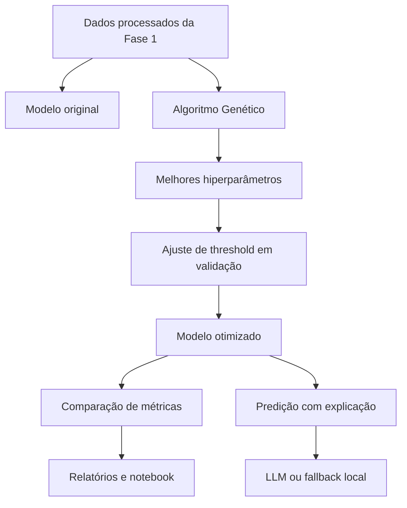
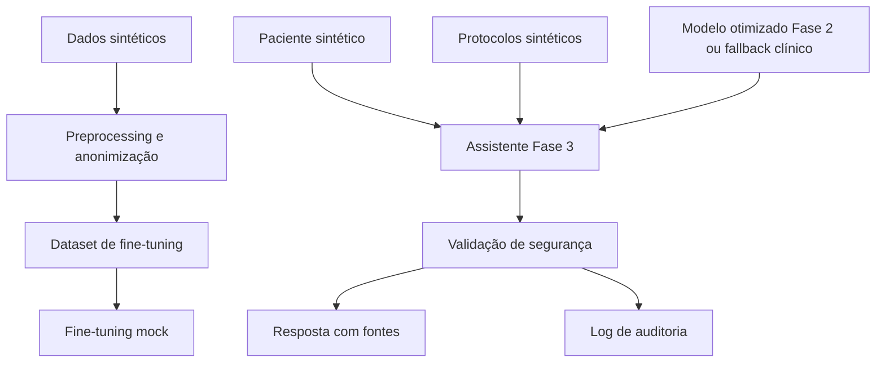

# Detecção de Sepse com Machine Learning - Tech Challenge Fase 2

Projeto acadêmico para apoio à triagem de risco de sepse. A Fase 2 evolui a base da Fase 1 com otimização de hiperparâmetros por Algoritmo Genético, ajuste de threshold em validação e explicações em linguagem natural com LLM ou fallback local.

Este projeto não substitui avaliação médica. A LLM apenas explica a saída do modelo preditivo e não emite diagnóstico definitivo.

## Estrutura

```text
.
|-- __main__.py                         # API FastAPI original + /predict/explain
|-- data/processed/                     # dados processados da Fase 1
|-- modelos_salvos/                     # modelo original
|-- models/                             # modelo otimizado
|-- reports/                            # métricas, gráficos e relatórios
|-- logs/                               # logs
|-- tests/                              # testes automatizados
`-- src/tc_fase2/
    |-- genetic_algorithm.py
    |-- threshold_tuning.py
    |-- train_baseline.py
    |-- run_ga_experiments.py
    |-- train_optimized_model.py
    |-- compare_models.py
    |-- llm_explainer.py
    |-- predict_and_explain.py
    `-- update_report_results.py
```

## Arquitetura da solução



## Ambiente

```bash
python -m venv .venv
.venv\Scripts\activate
pip install -r requirements.txt
```

Para usar LLM real, configure `OPENAI_API_KEY`. Sem chave, o sistema usa fallback local.

PowerShell:

```powershell
$env:OPENAI_API_KEY="sua_chave"
```

## Execução rápida de teste

Use apenas para validar o fluxo técnico. Resultados `quick=True` não devem ser usados como resultado final da entrega.

```bash
python -m src.tc_fase2.train_baseline --quick
python -m src.tc_fase2.run_ga_experiments --quick
python -m src.tc_fase2.train_optimized_model --quick --allow-quick-results
python -m src.tc_fase2.compare_models
python -m src.tc_fase2.llm_explainer --mock
python -m src.tc_fase2.predict_and_explain
pytest
```

O treino otimizado bloqueia automaticamente hiperparâmetros vindos de `quick=True` quando `--allow-quick-results` não é informado.

## Execução final

Use estes comandos para gerar resultados finais completos:

```bash
python -m src.tc_fase2.train_baseline
python -m src.tc_fase2.run_ga_experiments
python -m src.tc_fase2.train_optimized_model
python -m src.tc_fase2.compare_models
python -m src.tc_fase2.llm_explainer --mock
python -m src.tc_fase2.predict_and_explain
python -m src.tc_fase2.update_report_results
pytest
```

Saídas principais:

- `reports/baseline_metrics.json`
- `reports/ga_experiments_summary.csv`
- `reports/threshold_tuning.csv`
- `reports/best_threshold.json`
- `models/optimized_model.pkl`
- `reports/optimized_metrics.json`
- `reports/model_comparison.md`
- `reports/predict_and_explain_example.json`
- `reports/relatorio_resultados.md`

## Ajuste de threshold

O modelo otimizado não aplica diretamente um threshold fixo no teste. O script `train_optimized_model.py`:

1. treina um modelo com treino;
2. calcula probabilidades na validação;
3. testa thresholds de `0.05` a `0.50`;
4. escolhe o melhor por fitness;
5. treina o modelo final com treino + validação;
6. aplica o threshold escolhido ao teste.

A fórmula documentada é:

```text
fitness = recall * 0.50 + f1_score * 0.35 + precision * 0.10 - fn_penalty * 0.05
```

O teste nunca é usado para escolher threshold.

## Interpretação dos resultados

Em sepse, recall e falsos negativos são mais importantes que accuracy isolada. Um falso negativo pode deixar de sinalizar um paciente em risco.

O trade-off esperado é:

- recall maior tende a reduzir falsos negativos;
- falsos positivos podem subir quando o modelo fica mais sensível;
- precision pode cair se houver muitos alertas falsos;
- F1-score ajuda a observar o equilíbrio entre precision e recall;
- a decisão final sempre depende de avaliação clínica.

## Escalabilidade e uso operacional

A solução foi organizada em módulos para facilitar manutenção e evolução. Em um cenário operacional, a API pode carregar o modelo otimizado salvo em `models/optimized_model.pkl`, aplicar o threshold ajustado em validação e expor a predição por meio dos endpoints `/predict` e `/predict/explain`.

Para uso real, ainda seriam necessários governança clínica, validação externa, monitoramento contínuo de desempenho, controle de drift dos dados e auditoria das explicações geradas pela LLM ou pelo fallback local.

## API

Rodar API:

```bash
python __main__.py
```

Endpoints:

- `GET /health`
- `GET /metadata`
- `POST /predict`
- `POST /predict/explain`
- `POST /reload`

A API tenta carregar primeiro `models/optimized_model.pkl`. Caso esse arquivo não esteja disponível, utiliza o modelo original em `modelos_salvos/`.

## Endpoint com explicação

`POST /predict/explain` recebe o mesmo payload de `/predict` e retorna:

- `probabilidade_sepse`
- `threshold_utilizado`
- `predicao`
- `classe_predita`
- `explicacao`
- `modo_explicacao`

Sem `OPENAI_API_KEY`, a explicação usa template local seguro.

## Exemplo de payload

```json
{
  "features": {
    "HR": 112,
    "Temp": 38.4,
    "Resp": 28,
    "MAP": 58,
    "Lactate": 3.1,
    "WBC": 16
  },
  "threshold": 0.12
}
```

Features ausentes são preenchidas com medianas do treino quando disponíveis.

## Relatórios

- `reports/relatorio_tecnico.md`: relatório técnico inicial.
- `reports/relatorio_resultados.md`: complemento gerado automaticamente com métricas disponíveis.

Se os CSV/JSON atuais estiverem marcados com `quick=True`, eles representam apenas validação técnica. Rode a execução final para preencher métricas finais reais.

## Notebook da Fase 2

O notebook novo está em `notebook/tech_challenge_fase2_resultados.ipynb`.

Ele apresenta os resultados finais da Fase 2 e não executa treinamento pesado. Também não roda novamente o Algoritmo Genético. O objetivo é carregar os arquivos da pasta `reports/` e apresentar a análise de forma visual, didática e adequada para revisão da banca.

O notebook contém tabelas, explicações em Markdown e gráficos simples em `matplotlib` para facilitar o entendimento de:

- baseline da Fase 1;
- três experimentos do Algoritmo Genético;
- melhor experimento e hiperparâmetros;
- ajuste de threshold em validação;
- comparação entre modelo original e modelo otimizado;
- trade-off entre recall, falsos negativos, falsos positivos, precision e F1-score;
- exemplos de explicação com LLM ou fallback local.

## Autor e portfólio

### Github: https://github.com/BMatheus1/projeto_sepse_2.0
### Youtube: https://www.youtube.com/watch?v=yUAQ6P2zKBM

# Tech Challenge Fase 3 - Assistente Médico de Sepse

## Objetivo

A Fase 3 evolui o projeto da Fase 2 para um assistente médico acadêmico de apoio à triagem de sepse. A solução usa dados internos sintéticos, curadoria para fine-tuning, consulta a pacientes sintéticos, protocolos internos sintéticos, validação de segurança, auditoria e respostas explicáveis com fontes.

## Arquitetura



## Estrutura da Fase 3

```text
data/fase3/
|-- raw/
|-- processed/
`-- synthetic/
knowledge_base/protocolos/
src/tc_fase3/
reports/fase3/
logs/fase3_assistant_audit.log
notebook/fase3_demo_assistente.ipynb
tests/test_fase3_*.py
```

## Como gerar dataset de fine-tuning

```bash
python -m src.tc_fase3.prepare_finetuning_dataset
```

Saídas:

- `data/fase3/processed/fine_tuning_dataset.jsonl`
- `reports/fase3/dataset_preparation_summary.json`

## Como rodar fine-tuning mock

```bash
python -m src.tc_fase3.train_finetune --mock
```

Saída:

- `models/fase3/fine_tuned/mock_finetuned_model.json`

O modo real opcional está estruturado com `--real`, mas não baixa modelos pesados automaticamente e depende de ambiente adequado.

## Como rodar demo

```bash
python -m src.tc_fase3.run_demo
```

Saída:

- `reports/fase3/demo_outputs.json`

## Como rodar avaliação

```bash
python -m src.tc_fase3.evaluate_assistant
```

Saídas:

- `reports/fase3/avaliacao_assistente.csv`
- `reports/fase3/avaliacao_assistente.json`

## Como rodar API da Fase 3

```bash
uvicorn src.tc_fase3.api:app --reload
```

Endpoints:

- `GET /fase3/health`
- `POST /fase3/assistant/ask`
- `POST /fase3/assistant/flow`
- `GET /fase3/logs/latest`

## Como rodar testes

```bash
pytest
```

Os testes da Fase 3 passam sem chave OpenAI, sem GPU e sem dependências pesadas opcionais.

## Segurança e limitações

- Dados e protocolos são sintéticos e usados apenas para fins acadêmicos.
- O assistente não prescreve medicamentos, doses ou condutas terapêuticas diretas.
- O assistente não fecha diagnóstico definitivo.
- Toda resposta exige validação humana obrigatória.
- Respostas devem citar fontes e diferenciar dados do paciente, protocolos e inferências.
- Fine-tuning real é opcional; o modo padrão é mock e reprodutível localmente.

## Logs

As interações são registradas em:

- `logs/fase3_assistant_audit.log`

Cada evento registra timestamp, paciente, pergunta, nós executados, fontes consultadas, nível de risco, modelo usado, status de segurança e exigência de validação humana.

## Entregáveis

- Dataset sintético/anonimizado para fine-tuning.
- Pipeline de preprocessing e curadoria.
- Fine-tuning mock e modo real opcional.
- Assistente com compatibilidade LangChain.
- Fluxo LangGraph ou fallback sequencial documentado.
- API FastAPI da Fase 3.
- Demo automatizada.
- Avaliação do assistente.
- Relatório técnico da Fase 3.
- Testes automatizados.

## Checklist da Fase 3

- [x] Dados sintéticos criados.
- [x] Protocolos internos sintéticos criados.
- [x] Preprocessing, anonimização e curadoria implementados.
- [x] Dataset JSONL conversacional gerado.
- [x] Fine-tuning mock implementado.
- [x] Modo real opcional preparado.
- [x] Assistente médico acadêmico implementado.
- [x] Consulta a pacientes e protocolos implementada.
- [x] Integração com modelo da Fase 2 ou fallback clínico implementada.
- [x] Segurança, logging e auditoria implementados.
- [x] Fluxo LangGraph/fallback sequencial implementado.
- [x] API FastAPI da Fase 3 implementada.
- [x] Demo, avaliação, notebook e relatório criados.
- [x] Testes automatizados adicionados.

