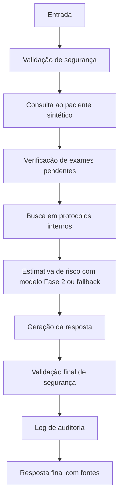

# Fluxo LangGraph - Assistente de Sepse Fase 3

Quando `langgraph` está disponível, a estrutura pode ser compilada como grafo. Em ambiente local sem essa dependência, o projeto usa fallback sequencial com os mesmos nós e a mesma ordem de execução.
