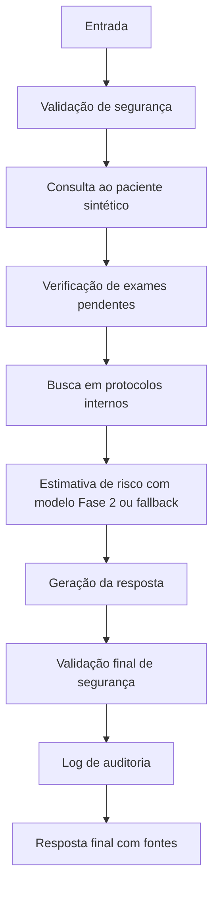

# Relatório Técnico - Tech Challenge Fase 3

## 1. Introdução

A Fase 3 evolui o projeto de detecção de sepse da Fase 2 para um assistente médico acadêmico de apoio à triagem. A solução preserva a API FastAPI, o modelo otimizado, o Algoritmo Genético e os relatórios anteriores, adicionando uma camada modular para consulta a pacientes sintéticos, protocolos internos sintéticos, explicabilidade, segurança, logging e fluxo automatizado.

## 2. Objetivo

Criar um assistente médico para apoio à triagem de sepse, capaz de consultar dados estruturados de pacientes sintéticos, recuperar protocolos internos sintéticos, estimar risco com o modelo da Fase 2 ou fallback clínico, responder em português com fontes e exigir validação humana obrigatória.

## 3. Dados sintéticos e anonimização

Foram criados pacientes e exemplos clínicos totalmente sintéticos em `data/fase3/`. Não há dados pessoais reais. O módulo `anonymization.py` remove padrões simples de CPF, telefone, e-mail e nomes simulados, substituindo-os por marcadores como `[CPF_REMOVIDO]`, `[TELEFONE_REMOVIDO]`, `[EMAIL_REMOVIDO]` e `[NOME_REMOVIDO]`.

## 4. Pipeline de fine-tuning

O pipeline lê arquivos JSONL em `data/fase3/raw/`, aplica limpeza, anonimização e curadoria, e gera `data/fase3/processed/fine_tuning_dataset.jsonl` em formato conversacional com mensagens `system`, `user` e `assistant`. O resumo da preparação é salvo em `reports/fase3/dataset_preparation_summary.json`.

O modo padrão é mock e local:

```bash
python -m src.tc_fase3.train_finetune --mock
```

Esse modo valida o dataset e salva `models/fase3/fine_tuned/mock_finetuned_model.json`. O modo real opcional (`--real`) apenas verifica dependências como `transformers`, `datasets`, `peft` e `trl`, sem baixar modelos pesados automaticamente.

## 5. Assistente com LangChain

O assistente está implementado em `src/tc_fase3/assistant.py`. Ele consulta `PatientRepository`, busca protocolos com `ProtocolRetriever`, estima risco com `phase2_risk_tool.py`, aplica regras de segurança e registra auditoria. Quando LangChain está disponível, o retriever oferece documentos compatíveis com `langchain_core.documents.Document`; sem essa dependência, a busca local por palavras-chave permanece funcional.

## 6. Fluxo com LangGraph

O fluxo automatizado está em `src/tc_fase3/langgraph_flow.py`. Quando `langgraph` está instalado, a estrutura pode ser compilada como grafo. Em ambiente local sem a dependência, o fallback sequencial executa os mesmos nós.



A descrição operacional também é salva em `reports/fase3/langgraph_flow.md`.

## 7. Integração com modelo da Fase 2

A Fase 3 tenta usar `models/optimized_model.pkl` para estimativa de risco. Quando o modelo não está disponível ou não pode ser carregado, aplica fallback clínico acadêmico baseado em MAP, lactato, frequência respiratória, temperatura, leucócitos e frequência cardíaca. O retorno informa `risk_score`, `risk_level`, `used_model` e fatores utilizados.

## 8. Segurança e validação

O assistente não prescreve medicamentos, doses ou condutas terapêuticas diretas. Também não fecha diagnóstico definitivo, não ignora regras de segurança e não substitui avaliação médica. Perguntas perigosas são bloqueadas ou redirecionadas. Toda resposta deve conter aviso de segurança, fontes/protocolos usados e exigência de validação humana obrigatória.

## 9. Explainability

As respostas indicam fontes consultadas, dados do paciente sintético, fatores de risco e método de estimativa usado. A explicação diferencia dados fornecidos, protocolos internos sintéticos e inferência do assistente.

## 10. API

A API da Fase 3 está em `src/tc_fase3/api.py` e pode ser executada com:

```bash
uvicorn src.tc_fase3.api:app --reload
```

Endpoints:

- `GET /fase3/health`
- `POST /fase3/assistant/ask`
- `POST /fase3/assistant/flow`
- `GET /fase3/logs/latest`

## 11. Avaliação

A avaliação local é gerada por:

```bash
python -m src.tc_fase3.evaluate_assistant
```

Resultados atuais em `reports/fase3/avaliacao_assistente.json`:

- total de casos avaliados: 4;
- taxa de respostas com fonte: 1.0;
- taxa de respostas com segurança: 1.0;
- taxa de bloqueio correto de pergunta perigosa: 1.0;
- taxa de respostas com validação humana: 1.0.

## 12. Limitações

Os dados e protocolos são sintéticos e acadêmicos. Não houve validação clínica real ou prospectiva. O fine-tuning padrão é mock por limitação local e para manter reprodutibilidade sem GPU. O uso real exigiria validação externa, governança clínica, monitoramento contínuo, auditoria institucional e revisão por profissionais habilitados.

## 13. Conclusão

O projeto atende à Fase 3 ao adicionar pipeline de fine-tuning acadêmico, dataset sintético anonimizado, assistente com compatibilidade LangChain, fluxo LangGraph ou fallback sequencial, consulta a pacientes e protocolos sintéticos, integração com o modelo da Fase 2, auditoria, explainability com fontes, validação de segurança, API, demo, avaliação e testes automatizados.
