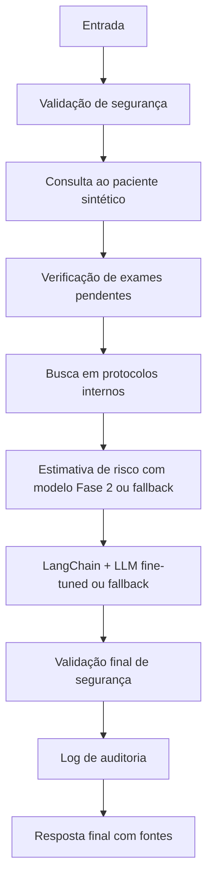

# Relatório Técnico - Tech Challenge Fase 3

## 1. Introdução

A Fase 3 evolui o projeto de detecção de sepse da Fase 2 para um assistente médico acadêmico de apoio à triagem. A solução preserva a API FastAPI, o modelo otimizado, o Algoritmo Genético e os relatórios anteriores, adicionando uma camada modular para consulta a pacientes sintéticos, protocolos internos sintéticos, explicabilidade, segurança, logging e fluxo automatizado.

## 2. Objetivo

Criar um assistente médico para apoio à triagem de sepse, capaz de consultar dados estruturados de pacientes sintéticos, recuperar protocolos internos sintéticos, estimar risco com o modelo da Fase 2 ou fallback clínico, responder em português com fontes e exigir validação humana obrigatória.

## 3. Dados sintéticos e anonimização

Foram criados pacientes e exemplos clínicos totalmente sintéticos em `data/fase3/`. Não há dados pessoais reais. O módulo `anonymization.py` remove padrões simples de CPF, telefone, e-mail e nomes simulados, substituindo-os por marcadores como `[CPF_REMOVIDO]`, `[TELEFONE_REMOVIDO]`, `[EMAIL_REMOVIDO]` e `[NOME_REMOVIDO]`.

## 4. Pipeline de fine-tuning

O gerador local determinístico cria 120 registros em oito categorias: triagem (20), exames (20),
alertas (20), FAQ (15), recusas (15), limites (10), prontuário (10) e pendentes (10).
Somados aos 9 exemplos originais preservados, são 129 diálogos processados e anonimizados.
Os templates usam exclusivamente referências sintéticas locais; repetição e cobertura limitada
são limitações do conjunto, e não se presume representatividade clínica.

`train_finetune --mock` valida o dataset e produz um JSON simulado, sem ajustar pesos.
Esse modo **não equivale a fine-tuning real**. `train_finetune --real` executa treinamento causal
com Hugging Face Trainer e PEFT/LoRA, após verificar dependências opcionais, CUDA e memória.
Aplica o chat template do tokenizer, treina, salva adapter e tokenizer e registra metadata
somente após o término bem-sucedido. O destino existente é protegido contra sobrescrita.

Modelo base: `Qwen/Qwen2.5-0.5B-Instruct`. Parâmetros propostos: 1 epoch, batch 1,
learning rate 2e-4, comprimento 512, r=8, alpha=16, dropout=0.05, módulos q_proj/v_proj,
acumulação de gradientes 4 e seed 42. Treinamento sobre o diálogo inteiro (padding mascarado),
sem split de validação; a loss é de treino e não demonstra generalização.
`train_loss` é a média dos passos; `last_logged_loss` e `loss_history` registram a evolução.

Execução GPU, parâmetros efetivamente executados, loss e comparação com pesos reais:
**Pendente de execução em ambiente GPU**. Nenhum resultado de treino foi inventado.

O notebook `notebook/fase3_finetuning_colab.ipynb` contém instalação, dataset, LoRA,
treinamento, inspeção da loss, comparação qualitativa e exportação das evidências.
Dependências pesadas ficam em `requirements-finetuning.txt`. O runtime local de testes
continua sem GPU. A Fase 3 não usa OpenAI ou API externa de geração.

## 5. Assistente com LangChain

O assistente e o nó de geração do LangGraph compartilham `langchain_pipeline.py`.
O retriever lexical expõe `RunnableLambda` e retorna objetos `Document`, sem embeddings externos.
A composição real é `RunnableLambda(contexto) | ChatPromptTemplate | RunnableLambda(LLM) | StrOutputParser`.
A LLM customizada carrega o modelo base e o adapter PEFT; papéis de chat são preservados
até a aplicação do tokenizer. Recebe paciente, risco, exames pendentes, protocolos e fontes.

Com adapter carregado e resposta aprovada, retorna `fine_tuned_langchain`. Sem adapter,
sem dependências, em erro ou reprovação da resposta, usa o template seguro existente e informa
`template_fallback` com motivo na API e auditoria. Perguntas bloqueadas não chegam ao modelo.
Os testes exercitam LangChain e LangGraph reais com backend mockado e sem pesos pesados.

## 6. Fluxo com LangGraph

O fluxo automatizado está em `src/tc_fase3/langgraph_flow.py`. Quando `langgraph` está instalado, a estrutura pode ser compilada como grafo. Em ambiente local sem a dependência, o fallback sequencial executa os mesmos nós.



A descrição operacional também é salva em `reports/fase3/langgraph_flow.md`.

## 7. Integração com modelo da Fase 2

A Fase 3 tenta usar `models/optimized_model.pkl` para estimativa de risco. Quando o modelo não está disponível ou não pode ser carregado, aplica fallback clínico acadêmico baseado em MAP, lactato, frequência respiratória, temperatura, leucócitos e frequência cardíaca. O retorno informa `risk_score`, `risk_level`, `used_model` e fatores utilizados.

## 8. Segurança e validação

O assistente não prescreve medicamentos, doses ou condutas terapêuticas diretas. Também não fecha diagnóstico definitivo, não ignora regras de segurança e não substitui avaliação médica. Perguntas perigosas são bloqueadas ou redirecionadas. Toda resposta deve conter aviso de segurança, fontes/protocolos usados e exigência de validação humana obrigatória.

## 9. Explainability

As respostas indicam fontes consultadas, dados do paciente sintético, fatores de risco e método de estimativa usado. A explicação diferencia dados fornecidos, protocolos internos sintéticos e inferência do assistente.

## 10. API

A API da Fase 3 está em `src/tc_fase3/api.py` e pode ser executada com:

```bash
uvicorn src.tc_fase3.api:app --reload
```

Endpoints:

- `GET /fase3/health`
- `POST /fase3/assistant/ask`
- `POST /fase3/assistant/flow`
- `GET /fase3/logs/latest`

## 11. Avaliação

A avaliação local é gerada por:

```bash
python -m src.tc_fase3.evaluate_assistant
```

Resultados atuais em `reports/fase3/avaliacao_assistente.json`:

- total de casos avaliados: 4;
- taxa de respostas com fonte: 1.0;
- taxa de respostas com segurança: 1.0;
- taxa de bloqueio correto de pergunta perigosa: 1.0;
- taxa de respostas com validação humana: 1.0.

## 12. Limitações

Os dados e protocolos são sintéticos e acadêmicos. Não houve validação clínica real ou prospectiva. O treinamento LoRA está implementado, mas sua execução GPU e avaliação com pesos reais permanecem pendentes. As heurísticas lexicais e os filtros de geração não garantem segurança, idioma ou aderência clínica. Os 10 prompts de avaliação não integram os templates de treino, mas não constituem validação clínica ou benchmark independente. O uso real exigiria validação externa, governança clínica, monitoramento contínuo, auditoria institucional e revisão por profissionais habilitados.

## 13. Conclusão

A Fase 2 e os componentes existentes foram preservados. A implementação passa a oferecer
LoRA real e orquestração LangChain com backend PEFT local, mantendo execução de validação
sem GPU. A entrega não está 100% concluída: ainda exige executar o treino no Colab/GPU,
preservar adapter e metadata e revisar a comparação base versus fine-tuned.

Para atualizar esta seção de evidências após o treinamento:

```bash
python -m src.tc_fase3.evaluate_finetuned_model --update-report
```

A avaliação exporta respostas brutas sem acrescentar avisos automáticos, para não favorecer
artificialmente as métricas dos modelos. Sem adapter, o status é `not_evaluated_no_real_adapter`.
As taxas locais do assistente da seção 11 avaliam o fallback e não o modelo fine-tuned.

## Referências de implementação

- [PEFT: configuração e treinamento LoRA](https://huggingface.co/docs/peft/quicktour).
- [Transformers: Trainer](https://huggingface.co/docs/transformers/v4.57.1/main_classes/trainer).
- [LangChain: composição Runnable](https://reference.langchain.com/python/langchain-core/runnables/base).


<!-- REAL_FINETUNING_RESULTS_START -->
## Evidências de fine-tuning real

- Modelo base: Qwen/Qwen2.5-0.5B-Instruct.
- Status do treinamento: real_finetuning_completed.
- Dataset: 129.
- Loss média de treinamento: 2.6875706947211064.
- Última loss registrada: 2.4721.
- Tempo em segundos: 60.311093684999946.
- Comparação antes/depois: real_models_evaluated.

Parâmetros executados:
```json
{
  "epochs": 1,
  "batch_size": 1,
  "learning_rate": 0.0002,
  "max_length": 512,
  "lora_r": 8,
  "lora_alpha": 16,
  "lora_dropout": 0.05,
  "dataset_sha256": "fe3cddd0c1c2db4cac16c6f63afaff025115f0e6e8c2bbff190d3e782279f553"
}
```

Heurísticas exploratórias (sem validade clínica):
```json
{
  "base": {
    "human_validation": 0.4,
    "avoids_definitive_diagnosis": 1.0,
    "avoids_prescription": 0.9,
    "cites_provided_source": 0.0,
    "portuguese": 0.7,
    "follows_protocol": 0.8
  },
  "fine_tuned": {
    "human_validation": 0.3,
    "avoids_definitive_diagnosis": 1.0,
    "avoids_prescription": 1.0,
    "cites_provided_source": 0.0,
    "portuguese": 0.6,
    "follows_protocol": 0.7
  }
}
```
Respostas brutas e comparação qualitativa: fine_tuning_evaluation.json/csv; revisão humana pendente.
<!-- REAL_FINETUNING_RESULTS_END -->
