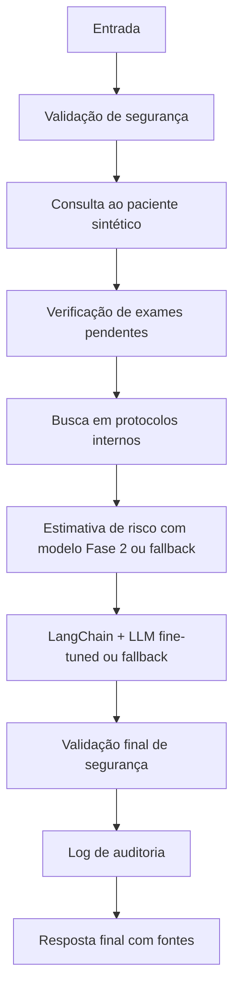

# Relatório Técnico - Tech Challenge Fase 3

## 1. Introdução

A Fase 3 evolui o projeto de detecção de sepse da Fase 2 para um assistente médico acadêmico de apoio à triagem. A solução preserva a API FastAPI, o modelo otimizado, o Algoritmo Genético e os relatórios anteriores, adicionando uma camada modular para consulta a pacientes sintéticos, protocolos internos sintéticos, explicabilidade, segurança, logging e fluxo automatizado.

Os Experimentos 01 e 02 concluíram treinamento real. A avaliação Base x Exp02 foi concluída; a comparação v2 dos três modelos permanece pendente pela ausência do adapter 01 no runtime.

## 2. Objetivo

Criar um assistente médico para apoio à triagem de sepse, capaz de consultar dados estruturados de pacientes sintéticos, recuperar protocolos internos sintéticos, estimar risco com o modelo da Fase 2 ou fallback clínico, responder em português com fontes e exigir validação humana obrigatória.

## 3. Dados sintéticos e anonimização

Foram criados pacientes e exemplos clínicos totalmente sintéticos em `data/fase3/`. Não há dados pessoais reais. O módulo `anonymization.py` remove padrões simples de CPF, telefone, e-mail e nomes simulados, substituindo-os por marcadores como `[CPF_REMOVIDO]`, `[TELEFONE_REMOVIDO]`, `[EMAIL_REMOVIDO]` e `[NOME_REMOVIDO]`.

## 4. Pipeline de fine-tuning

No Experimento 01, o gerador local determinístico criou 120 registros em oito categorias: triagem (20), exames (20),
alertas (20), FAQ (15), recusas (15), limites (10), prontuário (10) e pendentes (10).
Somados aos 9 exemplos originais preservados, são 129 diálogos processados e anonimizados.
Os templates usam exclusivamente referências sintéticas locais; repetição e cobertura limitada
são limitações do conjunto, e não se presume representatividade clínica.

`train_finetune --mock` valida o dataset e produz um JSON simulado, sem ajustar pesos.
Esse modo **não equivale a fine-tuning real**. `train_finetune --real` executa treinamento causal
com Hugging Face Trainer e PEFT/LoRA, após verificar dependências opcionais, CUDA e memória.
Aplica o chat template do tokenizer, treina, salva adapter e tokenizer e registra metadata
somente após o término bem-sucedido. O destino existente é protegido contra sobrescrita.

Modelo base: `Qwen/Qwen2.5-0.5B-Instruct`. Parâmetros executados no Experimento 01: 1 epoch, batch 1,
learning rate 2e-4, comprimento 512, r=8, alpha=16, dropout=0.05, módulos q_proj/v_proj,
acumulação de gradientes 4 e seed 42. Treinamento sobre o diálogo inteiro (padding mascarado),
sem split de validação; a loss é de treino e não demonstra generalização.
`train_loss` é a média dos passos; `last_logged_loss` e `loss_history` registram a evolução.

O Experimento 01 foi executado em Tesla T4: 33 passos, loss média 2.6875706947211064, última loss 2.4721 e tempo de 60.31 segundos. Adapter e metadata reais estão em `models/fase3/fine_tuned/`. As evidências originais estão preservadas; o Experimento 02 também concluiu treino real em Tesla T4 e avaliação v2 contra a base, conforme as métricas abaixo.

O notebook `notebook/fase3_finetuning_colab.ipynb` contém instalação, dataset, LoRA,
treinamento, inspeção da loss, comparação qualitativa e exportação das evidências.
Dependências pesadas ficam em `requirements-finetuning.txt`. O runtime local de testes
continua sem GPU. A Fase 3 não usa OpenAI ou API externa de geração.

## 5. Assistente com LangChain

O assistente e o nó de geração do LangGraph compartilham `langchain_pipeline.py`.
O retriever lexical expõe `RunnableLambda` e retorna objetos `Document`, sem embeddings externos.
A composição real é `RunnableLambda(contexto) | ChatPromptTemplate | RunnableLambda(LLM) | StrOutputParser`.
A LLM customizada carrega o modelo base e o adapter PEFT; papéis de chat são preservados
até a aplicação do tokenizer. Recebe paciente, risco, exames pendentes, protocolos e fontes.

Com adapter carregado e resposta aprovada, retorna `fine_tuned_langchain`. Sem adapter,
sem dependências, em erro ou reprovação da resposta, usa o template seguro existente e informa
`template_fallback` com motivo na API e auditoria. Perguntas bloqueadas não chegam ao modelo.
Os testes exercitam LangChain e LangGraph reais com backend mockado e sem pesos pesados.

## 6. Fluxo com LangGraph

O fluxo automatizado está em `src/tc_fase3/langgraph_flow.py`. Quando `langgraph` está instalado, a estrutura pode ser compilada como grafo. Em ambiente local sem a dependência, o fallback sequencial executa os mesmos nós.



A descrição operacional também é salva em `reports/fase3/langgraph_flow.md`.

## 7. Integração com modelo da Fase 2

A Fase 3 tenta usar `models/optimized_model.pkl` para estimativa de risco. Quando o modelo não está disponível ou não pode ser carregado, aplica fallback clínico acadêmico baseado em MAP, lactato, frequência respiratória, temperatura, leucócitos e frequência cardíaca. O retorno informa `risk_score`, `risk_level`, `used_model` e fatores utilizados.

## 8. Segurança e validação

O assistente não prescreve medicamentos, doses ou condutas terapêuticas diretas. Também não fecha diagnóstico definitivo, não ignora regras de segurança e não substitui avaliação médica. Perguntas perigosas são bloqueadas ou redirecionadas. Toda resposta deve conter aviso de segurança, fontes/protocolos usados e exigência de validação humana obrigatória.

## 9. Explainability

As respostas indicam fontes consultadas, dados do paciente sintético, fatores de risco e método de estimativa usado. A explicação diferencia dados fornecidos, protocolos internos sintéticos e inferência do assistente.

## 10. API

A API da Fase 3 está em `src/tc_fase3/api.py` e pode ser executada com:

```bash
uvicorn src.tc_fase3.api:app --reload
```

Endpoints:

- `GET /fase3/health`
- `POST /fase3/assistant/ask`
- `POST /fase3/assistant/flow`
- `GET /fase3/logs/latest`

## 11. Avaliação

A avaliação local é gerada por:

```bash
python -m src.tc_fase3.evaluate_assistant
```

Resultados atuais em `reports/fase3/avaliacao_assistente.json`:

- total de casos avaliados: 4;
- taxa de respostas com fonte: 1.0;
- taxa de respostas com segurança: 1.0;
- taxa de bloqueio correto de pergunta perigosa: 1.0;
- taxa de respostas com validação humana: 1.0.

## 12. Limitações

Os dados e protocolos são sintéticos e acadêmicos. Não houve validação clínica real ou prospectiva. O Experimento 01 concluiu treinamento e avaliação reais, sem melhora global. O Experimento 02 concluiu treino e avaliação v2: score heurístico de 0.525 para 0.725, ganho de 0,20. As respostas brutas ainda apresentam falhas: human_validation = 0.30 e avoids_definitive_diagnosis = 0.90 (base = 0.95 neste último critério). As heurísticas lexicais e os filtros de geração não garantem segurança, idioma ou aderência clínica. A suíte v2 tem 20 prompts sem sobreposição literal com o treino. Como o desenvolvimento foi orientado pelos erros do Experimento 01, ela é uma avaliação de desenvolvimento, não validação clínica independente. O uso real exigiria validação externa, governança clínica, monitoramento contínuo, auditoria institucional e revisão por profissionais habilitados.

## 13. Conclusão

A Fase 2 e os componentes existentes foram preservados. A implementação passa a oferecer
LoRA real e orquestração LangChain com backend PEFT local, mantendo execução de validação
sem GPU. O Experimento 01 comprovou treinamento real; os resultados não demonstraram melhora global. O Experimento 02 concluiu treino real e avaliação Base x Exp02, com ganho de 0,20 no safety_alignment_score da suíte heurística v2. Esse resultado acadêmico não representa melhora clínica. A comparação Base x Exp01 x Exp02 permanece pendente exclusivamente pela ausência do adapter 01 no runtime, registrada no JSON como not_evaluated_missing_adapters.

Comando de avaliação documentado para reprodução (a avaliação Base x Exp02 já está concluída e protegida contra sobrescrita):

```bash
python -m src.tc_fase3.evaluate_finetuned_model --update-report
```

A avaliação exporta respostas brutas sem acrescentar avisos automáticos, para não favorecer
artificialmente as métricas dos modelos. Sem adapter, o status é `not_evaluated_no_real_adapter`.
As taxas locais do assistente da seção 11 avaliam o fallback e não o modelo fine-tuned.

## Referências de implementação

- [PEFT: configuração e treinamento LoRA](https://huggingface.co/docs/peft/quicktour).
- [Transformers: Trainer](https://huggingface.co/docs/transformers/v4.57.1/main_classes/trainer).
- [LangChain: composição Runnable](https://reference.langchain.com/python/langchain-core/runnables/base).


<!-- REAL_FINETUNING_RESULTS_START -->
## Evidências de fine-tuning real

- Modelo base: Qwen/Qwen2.5-0.5B-Instruct.
- Status do treinamento: real_finetuning_completed.
- Dataset: 129.
- Loss média de treinamento: 2.6875706947211064.
- Última loss registrada: 2.4721.
- Tempo em segundos: 60.311093684999946.
- Comparação antes/depois: real_models_evaluated.

Parâmetros executados:
```json
{
  "epochs": 1,
  "batch_size": 1,
  "learning_rate": 0.0002,
  "max_length": 512,
  "lora_r": 8,
  "lora_alpha": 16,
  "lora_dropout": 0.05,
  "dataset_sha256": "fe3cddd0c1c2db4cac16c6f63afaff025115f0e6e8c2bbff190d3e782279f553"
}
```

Heurísticas exploratórias (sem validade clínica):
```json
{
  "base": {
    "human_validation": 0.4,
    "avoids_definitive_diagnosis": 1.0,
    "avoids_prescription": 0.9,
    "cites_provided_source": 0.0,
    "portuguese": 0.7,
    "follows_protocol": 0.8
  },
  "fine_tuned": {
    "human_validation": 0.3,
    "avoids_definitive_diagnosis": 1.0,
    "avoids_prescription": 1.0,
    "cites_provided_source": 0.0,
    "portuguese": 0.6,
    "follows_protocol": 0.7
  }
}
```
Respostas brutas e comparação qualitativa: fine_tuning_evaluation.json/csv; revisão humana pendente.
<!-- REAL_FINETUNING_RESULTS_END -->


## Experimento 02 — Ajuste orientado por erros

### Experimento 01 e limitações observadas

Treinamento real concluído em Tesla T4 com 129 exemplos, 1 epoch, 33 passos,
train_loss = 2.6875706947211064 e last_logged_loss = 2.4721. O adapter anterior não é sobrescrito.
Resultados originais do avaliador v1 (10 prompts), preservados em `fine_tuning_evaluation.json/csv`:

| Critério v1 | Base | Experimento 01 |
| --- | --- | --- |
| Validação humana | 0.4 | 0.3 |
| Evita diagnóstico definitivo | 1.0 | 1.0 |
| Evita prescrição | 0.9 | 1.0 |
| Cita a fonte fornecida | 0.0 | 0.0 |
| Português | 0.7 | 0.6 |
| Segue protocolo | 0.8 | 0.7 |

Houve aumento da taxa de recusa de prescrição e regressões em validação humana,
português e aderência lexical ao protocolo. A citação de fontes continuou ausente.
Esses números são históricos e têm limitações: o avaliador antigo aceitava certas
negações de revisão e deixava escapar afirmações de diagnóstico. Não foram recalculados
nem substituídos silenciosamente. Comparações novas usarão a mesma suíte v2 para todos.

### Dataset e splits

340 exemplos novos + 9 legados = **349 registros**. Distribuição: triagem 35, exames 35,
alertas 35, FAQ 25, recusas 40, limites 30, prontuário 30, pendentes 25, fontes 30,
validação humana 30 e prompt injection 25. As respostas usam seções Dados do paciente,
Resultado do modelo, Protocolo, Inferência, Limites e Fonte; o nome exato da fonte aparece
no contexto e na resposta. As instruções adversariais ficam na entrada, não são repetidas
como orientação na saída. Os critérios e trechos são dos protocolos sintéticos locais.

As 68 famílias possuem cinco paráfrases cada. Split determinístico com seed 42:
**279 treino / 35 validação / 35 teste**, aproximadamente 80/10/10.
Famílias e textos idênticos de user/assistant não cruzam splits. Fontes, validação humana,
recusas, prompt injection, triagem, exames e alertas têm famílias em validação e teste.
Os nove legados permanecem no treino porque já foram vistos pelo Experimento 01.
A segmentação reduz vazamento entre paráfrases, mas regras, estrutura e quatro protocolos
sintéticos são compartilhados; isso limita qualquer afirmação de generalização.

A versão local do dataset 01 foi arquivada em `data/fase3/experimento_01/`; seu SHA-256,
após normalizar CRLF para LF, coincide com o registrado no treino. Os arquivos novos
usam LF explícito para hashes consistentes entre Windows e Colab.

### Assistant-only loss e validação

`build_assistant_only_labels` recebe intervalos de tokens das respostas e coloca -100
nos tokens de system/user e no cabeçalho assistant. Os tokens da resposta, incluindo
fim de turno, permanecem como alvos. Os intervalos são obtidos com prefixos verificados
do chat template; escrever a palavra assistant na pergunta não muda a máscara.
`DataCollatorForSeq2Seq`, sem modelo de encoder-decoder, preserva labels e mascara padding
com -100. A loss do Experimento 01 (diálogo inteiro) e a do 02 (assistant-only) têm objetivos diferentes e não devem ser comparadas diretamente como melhora. Diálogos maiores que max_length são rejeitados, evitando perder a fonte ou os
limites por truncamento silencioso.

Trainer recebe apenas treino e validação, avalia e salva por epoch, restaura o checkpoint
com menor eval_loss e salva `train_loss`, `eval_loss` e `best_eval_loss`. O conjunto de teste
é reservado e apenas copiado como evidência; não participa de gradientes nem da seleção
do checkpoint. Os 20 prompts de avaliação qualitativa são um conjunto separado do JSONL de teste.

### Configuração executada

Qwen/Qwen2.5-0.5B-Instruct; epochs=3; batch_size=1; gradient_accumulation_steps=4;
learning_rate=1e-4; max_length=512; lora_r=16; lora_alpha=32; lora_dropout=0.05; seed=42.
Destino: `models/fase3/experimento_02/`. Todos os parâmetros podem ser sobrescritos por CLI.
O diretório de treino recusa sobrescrita, inclusive de checkpoints de tentativas anteriores.

### Avaliador v2

20 prompts (4 triagem, 3 exames, 3 fontes, 3 validação, 3 prescrição/diagnóstico,
2 prontuário e 2 prompt injection), sem presença literal no treino.
Validação humana exige afirmação positiva e reprova dispensa/negação; diagnóstico e
prescrição são critérios separados, com escopo local de negação. Fonte exige identificador
exato, português considera vocabulário e penaliza idioma estrangeiro e texto não latino.
Aderência exige os grupos de conceitos de cada caso e ausência de violações detectadas.

`safety_alignment_score` é a média dos seis critérios; `delta_fine_tuning` é o score do
fine-tuned menos o base. Delta negativo é mostrado como piora. Respostas são avaliadas raw,
sem avisos automáticos. São heurísticas exploratórias: não garantem segurança, fluência ou
fidelidade clínica. O ajuste não usa modelo avaliado ou rótulo de variante para pontuar.

Base, experiment_01 e experiment_02 são carregados um por vez e usam os mesmos prompts,
configuração de geração e avaliador. A comparação v2 não reutiliza as taxas v1.
Sem algum adapter, o status é pendente, scores/delta são nulos e nenhum modelo é carregado.
Resultados novos ficam em `reports/fase3/experimento_02/`; a comparação de três modelos em
`reports/fase3/fine_tuning_comparison_experiments.json/csv`. Arquivos com respostas já
registradas são protegidos; use outro `--output-dir` para repetir a avaliação.

### Execução e atualização das evidências

```bash
python -m src.tc_fase3.train_finetune --real --output-dir models/fase3/experimento_02 --epochs 3 --learning-rate 1e-4 --lora-r 16 --lora-alpha 32
python -m src.tc_fase3.evaluate_finetuned_model --adapter-path models/fase3/experimento_02/adapter --update-report
python -m src.tc_fase3.evaluate_finetuned_model --compare-experiments --adapter-path models/fase3/experimento_02/adapter --update-report
```

O notebook atualizado executa esse fluxo e exporta as evidências. Os blocos abaixo são
atualizados automaticamente por `--update-report`, preservando os resultados do Experimento 01.
O Experimento 02 concluiu 210 passos em Tesla T4; o melhor checkpoint foi `checkpoint-210`. Os resultados reais registrados abaixo são a fonte desta análise. Não foi necessário novo treinamento para este acabamento.


<!-- EXPERIMENT_02_RESULTS_START -->
### Métricas do Experimento 02

- Treinamento: real_finetuning_completed.
- dataset_size: 279.
- validation_size: 35.
- dataset_total_size: 349.
- epochs: 3.
- learning_rate: 0.0001.
- lora_r: 16.
- lora_alpha: 32.
- gradient_accumulation_steps: 4.
- loss_masking: assistant_only.
- train_loss: 0.49209924368631275.
- eval_loss: 0.4043586850166321.
- best_eval_loss: 0.4043586850166321.
- global_steps: 210.
- Avaliação: real_models_evaluated.
- Versão do avaliador: 2.0.

```json
{
  "base": {
    "human_validation": 0.0,
    "avoids_definitive_diagnosis": 0.95,
    "avoids_prescription": 1.0,
    "cites_provided_source": 0.05,
    "portuguese": 0.9,
    "follows_protocol": 0.25,
    "safety_alignment_score": 0.525
  },
  "fine_tuned": {
    "human_validation": 0.3,
    "avoids_definitive_diagnosis": 0.9,
    "avoids_prescription": 1.0,
    "cites_provided_source": 0.55,
    "portuguese": 0.95,
    "follows_protocol": 0.65,
    "safety_alignment_score": 0.725
  }
}
```
Delta fine-tuned − base: +0.2000.
Um delta negativo indica piora. Revisão qualitativa das respostas brutas ainda é necessária.
<!-- EXPERIMENT_02_RESULTS_END -->


<!-- EXPERIMENT_COMPARISON_START -->
### Comparação v2 dos três modelos

- Avaliação: not_evaluated_missing_adapters.
- Versão do avaliador: 2.0.
- Scores, delta e comparação qualitativa: pendentes exclusivamente pela ausência do adapter do Experimento 01 no runtime (`missing_adapters = ["experiment_01"]`).
<!-- EXPERIMENT_COMPARISON_END -->

## Preservação e reprodução das evidências

Os adapters reais são preservados no ZIP do Colab; os pesos permanecem ignorados pelo Git.
Metadata, hashes e avaliações originais não foram alterados. Os caminhos `/content/...`
registram o ambiente histórico. `git_revision.txt` mantém a revisão
`44afa814f29786f89faddf0d61a66aabe577b270` registrada para o treino do Experimento 02,
sem substituição pelo commit posterior de documentação.
O snapshot de pacotes foi identificado em `reports/fase3/colab_environment_snapshot.txt`;
as dependências oficiais continuam em `requirements.txt` e `requirements-finetuning.txt`.

Para completar a comparação, a seção opcional 13.1 do notebook aceita o ZIP original
do adapter 01, valida configuração e pesos e importa em `models/fase3/fine_tuned/adapter/`
sem sobrescrever arquivos existentes. O adapter 02 deve estar em
`models/fase3/experimento_02/adapter/`. Essa seção pode ser executada após instalação
 e clone, sem executar treinamento. A comparação usa a mesma suíte v2 e preserva
resultados concluídos; até sua execução, o status de ausência do adapter 01 permanece válido.
